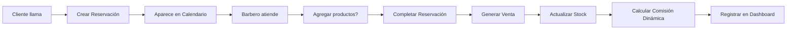

# DOCUMENTACIÓN COMPLETA DEL SISTEMA DE BARBERÍA

## 📋 ÍNDICE

1. [Arquitectura General](#arquitectura-general)
2. [Backend - API REST](#backend---api-rest)
3. [Frontend - Aplicación Vue.js](#frontend---aplicación-vuejs)
4. [Funcionalidades por Pantalla](#funcionalidades-por-pantalla)
5. [Lógica de Negocio por Módulo](#lógica-de-negocio-por-módulo)
6. [Flujo de Datos](#flujo-de-datos)
7. [Autenticación y Autorización](#autenticación-y-autorización)

---

## 🏗️ ARQUITECTURA GENERAL

### Stack Tecnológico

**Backend:** esta en la carpeta barberia_project_backend
- Node.js + Express.js
- TypeScript
- PostgreSQL (Base de datos)
- JWT (Autenticación)
- Swagger (Documentación API)

**Frontend:** esta en la carpeta barberia_project_frontend
- Vue.js 3 (Composition API)
- Pinia (State Management)
- Vue Router 4
- Tailwind CSS
- Axios (HTTP Client)
- ApexCharts (Gráficos)
- FullCalendar (Calendario)

### Arquitectura MVC

```
Frontend (Vue.js) ←→ API REST (Express.js) ←→ Base de Datos (PostgreSQL)
```

---

## 🖥️ BACKEND - API REST (esta en la carpeta barberia_project_backend)

### Estructura de Directorios

```
src/
├── controllers/     # Lógica de controladores
├── middleware/      # Middleware de autenticación y autorización
├── models/          # Modelos de datos
├── routes/          # Definición de rutas
├── services/        # Lógica de negocio
├── app.ts          # Configuración de Express
├── server.ts       # Entrada del servidor
└── database.ts     # Configuración de base de datos
```

### 🔗 ENDPOINTS DISPONIBLES

#### 🔐 Autenticación (`/api/auth`)
| Método | Endpoint | Descripción | Middleware |
|--------|----------|-------------|------------|
| POST | `/login` | Inicio de sesión | - |
| GET | `/me` | Obtener datos del usuario actual | Auth |
| PUT | `/change-password` | Cambiar contraseña | Auth |
| GET | `/users` | Listar usuarios (admin) | Auth + Admin |
| POST | `/users` | Crear usuario (admin) | Auth + Admin |
| PUT | `/users/:id` | Actualizar usuario (admin) | Auth + Admin |
| DELETE | `/users/:id` | Eliminar usuario (admin) | Auth + Admin |

#### 📊 Dashboard (`/api/dashboard`)
| Método | Endpoint | Descripción | Middleware |
|--------|----------|-------------|------------|
| GET | `/summary` | Resumen de dashboard | Auth |

#### 👨‍💼 Barberos (`/api/barbers`)
| Método | Endpoint | Descripción | Middleware |
|--------|----------|-------------|------------|
| GET | `/` | Listar barberos | Auth |
| GET | `/:id` | Obtener barbero por ID | Auth |
| POST | `/` | Crear barbero | Auth |
| PUT | `/:id` | Actualizar barbero | Auth |
| DELETE | `/:id` | Eliminar barbero | Auth |
| POST | `/:id/advances` | Crear adelanto de pago | Auth |

#### 🪑 Estaciones (`/api/stations`)
| Método | Endpoint | Descripción | Middleware |
|--------|----------|-------------|------------|
| GET | `/` | Listar estaciones | Auth |
| POST | `/` | Crear estación | Auth |
| PUT | `/:id` | Actualizar estación | Auth |
| DELETE | `/:id` | Eliminar estación | Auth |

#### ✂️ Servicios (`/api/services`)
| Método | Endpoint | Descripción | Middleware |
|--------|----------|-------------|------------|
| GET | `/` | Listar servicios (con paginación: `?page=X&limit=Y`) | Auth |
| GET | `/:id` | Obtener servicio por ID | Auth |
| POST | `/` | Crear servicio (manejo de error 409 por unicidad) | Auth |
| PUT | `/:id` | Actualizar servicio (manejo de error 409 por unicidad) | Auth |
| DELETE | `/:id` | Eliminar servicio | Auth |

#### 🛍️ Productos (`/api/products`)
| Método | Endpoint | Descripción | Middleware |
|--------|----------|-------------|------------|
| GET | `/` | Listar productos | Auth |
| GET | `/:id` | Obtener producto por ID | Auth |
| POST | `/` | Crear producto | Auth |
| PUT | `/:id` | Actualizar producto | Auth |
| DELETE | `/:id` | Eliminar producto | Auth |

#### 📅 Reservaciones (`/api/reservations`)
| Método | Endpoint | Descripción | Middleware |
|--------|----------|-------------|------------|
| GET | `/` | Listar reservaciones (con paginación: `?page=X&limit=Y`) | Auth |
| GET | `/:id` | Obtener reservación por ID | Auth |
| POST | `/` | Crear reservación | Auth |
| PUT | `/:id` | Actualizar reservación | Auth |
| DELETE | `/:id` | Eliminar reservación | Auth |
| GET | `/view/calendar` | Vista de calendario | Auth |
| POST | `/:id/complete` | Completar reservación → venta | Auth |
| POST | `/:id/products` | Añadir producto a reservación | Auth |
| DELETE | `/:id/products/:reservationProductId` | Eliminar producto de reservación | Auth |

#### 💰 Ventas (`/api/sales`)
| Método | Endpoint | Descripción | Middleware |
|--------|----------|-------------|------------|
| GET | `/` | Listar ventas (con paginación: `?page=X&limit=Y&barberId=Z&startDate=A&endDate=B`) | Auth |
| GET | `/:id` | Obtener venta por ID | Auth |
| GET | `/by-reservation/:reservationId` | Obtener venta por reservación | Auth |
| POST | `/direct` | Crear venta directa | Auth |

#### 📈 Reportes (`/api/reports`)
| Método | Endpoint | Descripción | Middleware |
|--------|----------|-------------|------------|
| GET | `/comprehensive-sales` | Reporte completo de ventas | Auth |
| GET | `/services-products-sales` | Ventas por servicios y productos | Auth |
| GET | `/station-usage` | Uso de estaciones | Auth |
| GET | `/customer-frequency` | Frecuencia de clientes | Auth |
| GET | `/peak-hours` | Horas pico | Auth |
| GET | `/detailed-barber-service-sales` | Ventas detalladas por barbero | Auth |
| GET | `/barber-payments` | Reporte de pagos a barberos | Auth |

#### 💵 Comisiones de Barberos (`/api/barber-commissions`)
| Método | Endpoint | Descripción | Middleware |
|--------|----------|-------------|------------|
| GET | `/monthly-summary` | Resumen mensual de comisiones | Auth |
| POST | `/finalize-payment` | Finalizar pago a barbero | Auth |
| GET | `/:barberId/services` | Servicios de barbero por mes | Auth |
| GET | `/:barberId/advances` | Adelantos de barbero por mes | Auth |

#### 💳 Pagos (`/api/payments`)
| Método | Endpoint | Descripción | Middleware |
|--------|----------|-------------|------------|
| GET | `/` | Listar pagos | Auth |
| PUT | `/:id` | Actualizar pago | Auth |

#### 🏪 Punto de Venta (`/api/pos`)
| Método | Endpoint | Descripción | Middleware |
|--------|----------|-------------|------------|
| GET | `/master-data` | Datos maestros del POS | Auth |

#### 📦 Inventario (`/api/inventory`)
| Método | Endpoint | Descripción | Middleware |
|--------|----------|-------------|------------|
| GET | `/summary` | Resumen de inventario | Auth |
| GET | `/movements` | Movimientos de inventario | Auth |
| POST | `/movements` | Crear movimiento de inventario | Auth |

#### ⚙️ Configuración (`/api/settings`)
| Método | Endpoint | Descripción | Middleware |
|--------|----------|-------------|------------|
| GET | `/` | Obtener todas las configuraciones | Auth + Admin |
| PUT | `/` | Actualizar configuraciones | Auth + Admin |
| GET | `/:key` | Obtener configuración por clave | Auth + Admin |

---

## 🎨 FRONTEND - APLICACIÓN VUE.JS (esta en la carpeta barberia_project_frontend)

### Estructura de Directorios

```
src/
├── components/      # Componentes reutilizables (ej. Modal.vue, TablaBarberia.vue, PaginationControls.vue)
├── views/          # Vistas/Pantallas principales
├── stores/         # Stores de Pinia (estado global)
├── router/         # Configuración de rutas
├── services/       # Servicios HTTP (Axios)
└── main.js         # Entrada de la aplicación
```

### 🛣️ RUTAS PRINCIPALES

| Ruta | Vista | Descripción |
|------|-------|-------------|
| `/` | DashboardView | Panel principal con métricas |
| `/login` | LoginView | Inicio de sesión |
| `/barbers` | BarbersView | Gestión de barberos |
| `/stations` | StationsView | Gestión de estaciones |
| `/services` | ServicesView | Gestión de servicios |
| `/products` | ProductsView | Gestión de productos |
| `/reservations` | ReservationsView | Gestión de reservaciones |
| `/schedule` | CalendarView | Calendario de citas |
| `/sales` | SalesView | Registro de ventas |
| `/payments` | BarberPaymentsReportView | Pagos a barberos |
| `/profile` | ProfileView | Perfil de usuario |
| `/settings` | SettingsView | Configuración |
| `/reports/*` | Reportes variados | Diferentes reportes |

### 🗃️ STORES DE PINIA

- **authStore**: Autenticación y usuario actual
- **barberStore**: Gestión de barberos
- **stationStore**: Gestión de estaciones
- **serviceStore**: Gestión de servicios, incluyendo el estado de paginación (`currentPage`, `itemsPerPage`, `totalPages`, `totalItems`) y acciones para cambiar de página (`setPage`) y de ítems por página (`setItemsPerPage`).
- **productStore**: Gestión de productos
- **reservationStore**: Gestión de reservaciones, incluyendo paginación.
- **salesStore**: Gestión de ventas, incluyendo paginación.
- **paymentStore**: Gestión de pagos a barberos y adelantos.
- **reportStore**: Datos de reportes
- **settingStore**: Configuraciones
- **userStore**: Gestión de usuarios

---

## 📱 FUNCIONALIDADES POR PANTALLA

### 1. 🏠 **Dashboard** (`/`)
**Endpoint Principal:** `GET /api/dashboard/summary`

**Funcionalidades:**
- ✅ Tarjetas de métricas en tiempo real:
  - Ventas de productos (hoy)
  - Ventas de servicios (hoy)
  - Reservas para hoy
  - Clientes atendidos (hoy)
  - Ingresos del mes
- ✅ Gráfico de área: Ventas de productos (últimos 30 días)
- ✅ Gráfico de área: Ventas de servicios (últimos 30 días)
- ✅ Tabla de pagos a barberos del mes actual (con comisiones dinámicas)
- ✅ Gráfico donut: Servicios populares de la semana

**Lógica de Negocio:**
- Se actualiza automáticamente al cargar la página
- Los datos se obtienen del endpoint de dashboard que consolida información de múltiples tablas

### 2. 🔐 **Login** (`/login`)
**Endpoint:** `POST /api/auth/login`

**Funcionalidades:**
- ✅ Formulario de inicio de sesión (email/password)
- ✅ Validación de credenciales
- ✅ Almacenamiento del token JWT
- ✅ Redirección automática al dashboard

**Lógica de Negocio:**
- Utiliza JWT para autenticación
- Token se guarda en localStorage
- Middleware verifica el token en cada petición

### 3. 👨‍💼 **Barberos** (`/barbers`)
**Endpoints:**
- `GET /api/barbers` - Listar
- `POST /api/barbers` - Crear
- `PUT /api/barbers/:id` - Actualizar
- `DELETE /api/barbers/:id` - Eliminar
- `POST /api/barbers/:id/advances` - Crear adelanto

**Funcionalidades:**
- ✅ Lista completa de barberos con tabla responsive
- ✅ Modal para crear/editar barberos con todos los campos necesarios.
- ✅ Campos: nombre, sueldo base, estación asignada, estado activo, etc.
- ✅ Eliminación con confirmación
- ✅ Vista móvil adaptativa

**Lógica de Negocio:**
- Cada barbero tiene una estación asignada
- Los barberos inactivos no aparecen en selecciones
- El sueldo base y las comisiones dinámicas se usan para calcular el pago.

### 4. 🪑 **Estaciones** (`/stations`)
**Endpoints:**
- `GET /api/stations` - Listar
- `POST /api/stations` - Crear
- `PUT /api/stations/:id` - Actualizar
- `DELETE /api/stations/:id` - Eliminar

**Funcionalidades:**
- ✅ CRUD completo de estaciones de trabajo
- ✅ Validación para evitar eliminación si hay barberos asignados

### 5. ✂️ **Servicios** (`/services`)
**Endpoints:**
- `GET /api/services` - Listar (con paginación)
- `POST /api/services` - Crear
- `PUT /api/services/:id` - Actualizar
- `DELETE /api/services/:id` - Eliminar

**Funcionalidades:**
- ✅ Gestión de servicios ofrecidos por la barbería
- ✅ **Tabla con paginación:** Muestra los servicios en una tabla paginada, incluyendo nombre, descripción, precio, duración y estado activo.
- ✅ **Modal de creación/edición:** Permite añadir nuevos servicios o editar existentes con campos para nombre, descripción, precio, duración y estado activo.
- ✅ Los servicios se vinculan a reservaciones

**Lógica de Negocio:**
- El porcentaje de comisión se aplica al calcular pagos a barberos
- La duración se usa en el calendario para bloquear tiempo

### 6. 🛍️ **Productos** (`/products`)
**Endpoints:**
- `GET /api/products` - Listar
- `POST /api/products` - Crear
- `PUT /api/products/:id` - Actualizar
- `DELETE /api/products/:id` - Eliminar

**Funcionalidades:**
- ✅ Inventario de productos para venta
- ✅ Campos: nombre, descripción, precio, stock actual, stock mínimo
- ✅ Control de stock automático

**Lógica de Negocio:**
- Stock se actualiza automáticamente con las ventas
- Alerta cuando el stock está por debajo del mínimo

### 7. 📅 **Reservaciones** (`/reservations`)
**Endpoints:**
- `GET /api/reservations` - Listar (con paginación)
- `POST /api/reservations` - Crear
- `PUT /api/reservations/:id` - Actualizar
- `DELETE /api/reservations/:id` - Eliminar
- `POST /api/reservations/:id/complete` - Completar → venta

**Funcionalidades:**
- ✅ Formulario de nueva reservación (cliente, barbero, estación, horario)
- ✅ Lista de reservaciones con filtros y paginación.
- ✅ Estados: pendiente, en proceso, completada, cancelada
- ✅ Completar reservación genera venta automática

**Lógica de Negocio:**
- Las reservaciones bloquean tiempo en el calendario
- Al completarse, se crea una venta automáticamente
- Se pueden agregar productos durante el servicio

### 8. 🗓️ **Calendario** (`/schedule`)
**Endpoint:** `GET /api/reservations/view/calendar`

**Funcionalidades:**
- ✅ Vista de calendario semanal
- ✅ Navegación por semanas
- ✅ Filtro por barbero o vista general
- ✅ Añadir cita desde el calendario
- ✅ Visualización de reservaciones por colores

**Lógica de Negocio:**
- Integración con FullCalendar
- Muestra reservaciones como bloques de tiempo
- Click en hora libre abre modal de nueva cita

### 9. 💰 **Ventas** (`/sales`)
**Endpoints:**
- `GET /api/sales` - Listar ventas (con paginación y filtros)
- `POST /api/sales/direct` - Crear venta directa

**Funcionalidades:**
- ✅ Lista de todas las ventas con paginación.
- ✅ Filtros: por día, semana, mes, barbero.
- ✅ Modal para ver detalles de venta.
- ✅ Registro de ventas directas (sin reservación).

**Lógica de Negocio:**
- Las ventas pueden originarse de reservaciones completadas o ser directas.
- Cada venta registra servicios y productos por separado.

### 10. 💵 **Pagos a Barberos** (`/payments`)
**Endpoints:**
- `GET /api/barber-commissions/monthly-summary`
- `POST /api/barber-commissions/finalize-payment`
- `GET /api/reports/barber-payments`

**Funcionalidades:**
- ✅ Resumen mensual de comisiones por barbero.
- ✅ Detalle de servicios realizados.
- ✅ Cálculo automático de comisiones dinámicas.
- ✅ Registro de adelantos.
- ✅ Finalización de pagos.
- ✅ Generación de comprobantes de pago en PDF.

**Lógica de Negocio:**
- Comisión dinámica basada en el rendimiento del barbero.
- Pago final = Total comisiones - Adelantos - Sueldo base.
- Sistema de estados: pendiente, pagado.

### 11. 📊 **Reportes**
Múltiples vistas de reportes mejoradas:
- Reporte completo de ventas
- Ventas por servicios y productos
- Uso de estaciones
- Frecuencia de clientes
- Horas pico
- Inventario
- Pagos a barberos

**Funcionalidades:**
- ✅ Gráficos interactivos con ApexCharts
- ✅ Filtros por fecha
- ✅ Exportación de datos
- ✅ Métricas y KPIs

---

## 🧠 LÓGICA DE NEGOCIO POR MÓDULO

### 🔐 **Módulo de Autenticación**
1. **Login**: Verifica credenciales → genera JWT
2. **Middleware**: Valida token en cada petición
3. **Roles**: Administrador vs Usuario regular
4. **Sesión**: Token guardado en localStorage
5. **Interceptors de Axios**: Manejo centralizado de la autenticación en el frontend.

### 👨‍💼 **Módulo de Barberos**
1. **Gestión**: CRUD completo de barberos.
2. **Estación**: Cada barbero tiene una estación asignada.
3. **Comisiones Dinámicas**: Se calculan en base a umbrales de ventas y porcentajes configurables.
4. **Adelantos**: Sistema de pagos anticipados.
5. **Estado**: Barberos activos/inactivos.

### 📅 **Módulo de Reservaciones**
1. **Creación**: Cliente + Barbero + Estación + Horario
2. **Paginación**: La lista de reservaciones está paginada.
3. **Estados**: Pendiente → En Proceso → Completada/Cancelada
4. **Productos**: Se pueden agregar durante el servicio
5. **Conversión**: Reservación completada → Venta automática

### 💰 **Módulo de Ventas**
1. **Origen**: Desde reservaciones o ventas directas.
2. **Paginación**: La lista de ventas está paginada.
3. **Composición**: Servicios + Productos
4. **Pago**: Efectivo, tarjeta, transferencia
5. **Comisiones**: Cálculo automático para barberos
6. **Stock**: Actualización automática de inventario

### 📊 **Módulo de Reportes**
1. **Dashboard**: Métricas en tiempo real
2. **Ventas**: Análisis por períodos y categorías
3. **Barberos**: Performance, comisiones y pagos.
4. **Inventario**: Control de stock y movimientos
5. **Clientes**: Frecuencia y patrones de visita

---

## 🔄 FLUJO DE DATOS

### 📝 **Flujo Principal: Desde Reservación hasta Pago**



### 🔄 **Flujo de Estados de Reservación**

```
PENDIENTE → EN PROCESO → COMPLETADA
    ↓              ↓
CANCELADA      CANCELADA
```

### 💸 **Flujo de Cálculo de Comisiones Dinámicas**

```
Venta de Servicio
    ↓
Precio × Porcentaje de Comisión del Servicio (según umbral de ventas)
    ↓
Acumular por Barbero por Mes
    ↓
Total Comisiones - Adelantos - Sueldo Base = Pago Final
```

---

## 🛡️ AUTENTICACIÓN Y AUTORIZACIÓN

### 🔑 **Sistema de Autenticación**
- **JWT**: JSON Web Tokens para autenticación stateless
- **Almacenamiento**: localStorage en frontend
- **Expiración**: Tokens con tiempo de vida limitado
- **Interceptors de Axios**: Axios intercepta y añade el token a las cabeceras de las peticiones salientes y maneja errores de autenticación (401) en las respuestas.

### 👥 **Roles y Permisos**
- **Administrador**: Acceso completo + gestión de usuarios y configuración.
- **Usuario**: Acceso a funcionalidades operativas (sin gestión de usuarios ni configuración).

### 🛡️ **Middleware de Seguridad**
- `authenticateToken`: Verifica JWT válido
- `authorizeRoles`: Verifica rol específico
- Redirección automática al login si no autenticado

### 🔒 **Rutas Protegidas**
- Todas las rutas requieren autenticación excepto `/login`.
- Rutas de admin: `/settings`, gestión de usuarios.
- Guard en Vue Router verifica autenticación antes de cargar las rutas.

---

## 📈 **MÉTRICAS Y KPIs DEL SISTEMA**

### 📊 **Dashboard Principal**
- Ventas diarias (servicios vs productos)
- Reservas del día
- Clientes atendidos
- Ingresos mensuales
- Servicios más populares

### 💰 **Métricas Financieras**
- Total de ventas por período
- Comisiones por barbero (dinámicas)
- Rentabilidad por servicio
- Control de gastos (adelantos)

### 👥 **Métricas Operativas**
- Utilización de estaciones
- Frecuencia de clientes
- Horas pico de actividad
- Performance por barbero

---

## 🚀 **TECNOLOGÍAS Y HERRAMIENTAS**

### **Backend**
- **Node.js**: Entorno de ejecución
- **Express.js**: Framework web
- **TypeScript**: Tipado estático
- **PostgreSQL**: Base de datos relacional
- **JWT**: Autenticación
- **Swagger**: Documentación API
- **Day.js**: Manipulación de fechas
- **Bcrypt**: Hash de contraseñas
- **CORS**: Manejo de Cross-Origin Resource Sharing
- **Dotenv**: Gestión de variables de entorno

### **Frontend**
- **Vue.js 3**: Framework frontend con Composition API
- **Pinia**: State management
- **Vue Router 4**: Enrutamiento
- **Tailwind CSS**: Framework CSS
- **Axios**: Cliente HTTP
- **ApexCharts**: Biblioteca de gráficos
- **FullCalendar**: Componente de calendario
- **Day.js**: Manipulación de fechas
- **jsPDF**: Generación de PDFs
- **jspdf-autotable**: Tablas en PDFs
- **Chart.js**: Librería de gráficos (utilizada en algunos reportes)

### **Herramientas de Desarrollo**
- **ESLint**: Linter
- **Prettier**: Formateador de código
- **Jest**: Testing framework (para Backend)
- **Vite**: Build tool
- **Nodemon**: Recarga automática del servidor (para Backend)
- **TS-Node**: Ejecución de TypeScript directamente (para Backend)
- **Cross-env**: Configuración de variables de entorno (para tests de Backend)

---

## 📱 **CARACTERÍSTICAS TÉCNICAS**

### ⚡ **Performance**
- Lazy loading de rutas
- Paginación en listas largas
- Caching de datos frecuentes
- Optimización de imágenes

### 📱 **Responsive Design**
- Mobile-first approach
- Breakpoints adaptativos
- Navegación touch-friendly
- Tablas responsivas

### 🔧 **Mantenibilidad**
- Código modular y reutilizable
- Separación de responsabilidades
- Documentación completa
- Testing automatizado

---

Este sistema de barbería ofrece una solución completa para la gestión operativa, desde la agenda de citas hasta el control financiero, con una interfaz moderna y funcionalidades robustas para optimizar el negocio.